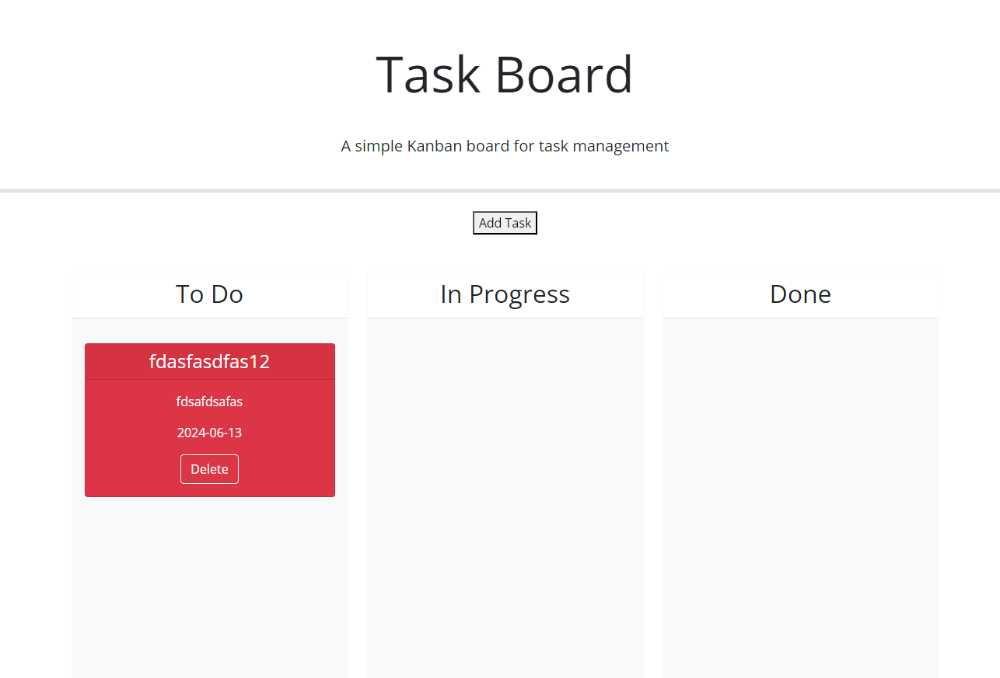

# task_board

Website can be access via : https://imgonnagoafk.github.io/task_board/

## Description
    This was created so that users are able to add task, assign each task a title, a description, and a due date. Afterwards there will be a a task card that is populated with those information inside of it. If the task is close to being due it will be colored yellow, if it is overdue it will be colored red, otherwise the card will be colored white. Each task card is able to be moved into each column and based on where the user wants it, and even deleted.

## Credit
    Starter code was provided by UNCC bootcamp and editted by Kevin Hoang